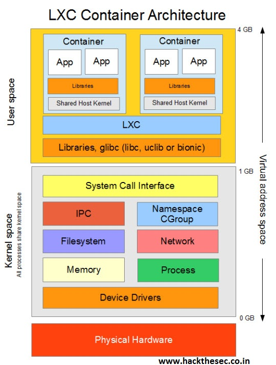

Los contenedores son tecnologías que permiten **empaquetar y aislar las aplicaciones junto a todo el entorno que necesitan durante su tiempo ejecución**. Los contenedores comparten el mismo kernel del sistema operativo y separan los procesos de las aplicaciones del resto del sistema 

Existen varias opciones entre las que se puede mencionar que aplican esta tecnología, pero es necesario diferenciar entre contendores de sistema operativo como LXC (LinuX Containers), OpenVZ y contenedores de aplicación como Docker.

## Que es es LXC?
LXC o  Linux Containers, ofrece un **entorno de virtualización a nivel del sistema operativo para linux.**  En efecto, este tipo de virtualización permite que sistemas operativos se ejecuten simultáneamente en un solo sistema de hardware.

Es decir, LXC permite que un servidor físico ejecute múltiples instancias de sistemas operativos aislados. Sin embargo, LXC no provee de una máquina virtual más bien provee un entorno virtual que tiene su propio espacio de procesos y redes, esto es posible gracias a que básicamente **LXC utiliza Cgroups y Namespaces para proporcionar el aislamiento** requerido. 

Para ser más específicos, LXC usa las siguientes características del kernel para contener procesos:
- Kernel namespaces (ipc, uts, mount, pid, network and user)
- Apparmor y  perfiles SELinux
- Politicas Seccomp
- Chroot (using pivot_root)
- CGroups (control groups)

LXC define su arquitectura de la siguiente manera.

Linux Containers tiene como objetivo crear un ambiente lo más cercano posible a una instalación estándar de Linux pero sin la necesidad de un kernel separado.

## Implementación
- [lxc-01-images-repository](lxc-01-images-repository.md)
- [lxc-02-container-creation](lxc-02-container-creation.md)
- [lxc-03-networking](lxc-03-networking.md)
- [lxc-04-storage](lxc-04-storage.md)
- [lxc-05-profile](lxc-05-profile.md)
- [lxc-06-snapshots](lxc-06-snapshots.md)
- [lxc-07-remote](lxc-07-remote.md)

## Ejemplitos
- [Here](examples/) 